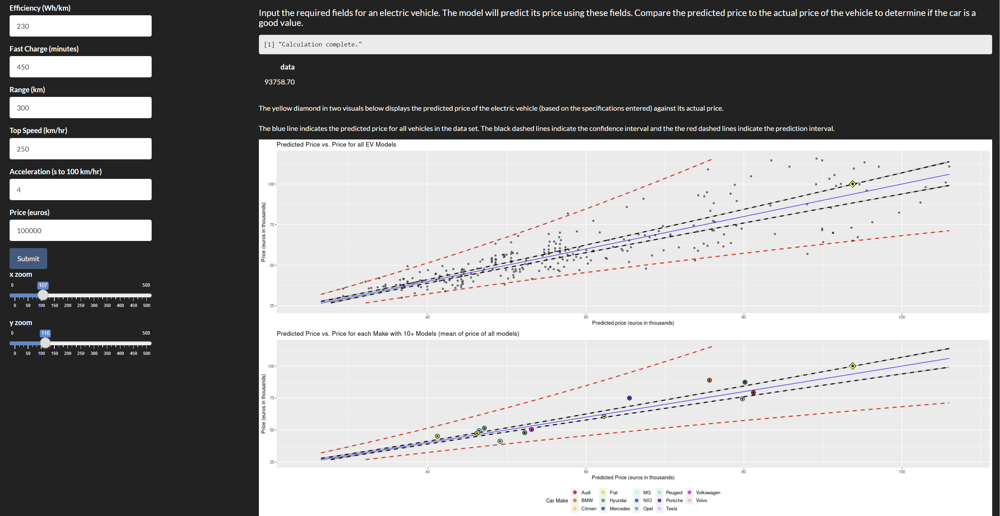

2024-01-22

# “Predict the Price of an Electric Car based on its Features”

## Table of Contents

[Overview](https://github.com/Na-ta-lie/Is-your-electric-car-overpriced-/blob/main/README.md#Overview)  
[Data](https://github.com/Na-ta-lie/Is-your-electric-car-overpriced-/blob/main/README.md#Data)  
[Development](https://github.com/Na-ta-lie/Is-your-electric-car-overpriced-/blob/main/README.md#Development)  
[Visuals](https://github.com/Na-ta-lie/Is-your-electric-car-overpriced-/blob/main/README.md#Visuals)  
[Links](https://github.com/Na-ta-lie/Is-your-electric-car-overpriced-/blob/main/README.md#Links)

### Overview

This R Shiny app allows you to explore a

### Data

This collection of data on electric vehicles came from [Kaggle
Dataset](https://www.kaggle.com/datasets/fatihilhan/electric-vehicle-specifications-and-prices/).
The original set included 360 observations and 9 variables.

**Variables**

- Battery: The capacity of the vehicle’s battery in kilowatt-hours
  (kWh).
- Car_name: The model name of the electric vehicle.
- Car_name_link: A direct link to the corresponding page on EV Database
  for more in-depth information.
- Efficiency: The energy efficiency rating of the vehicle in watt-hours
  per kilometer (Wh/km).
- Fast_charge: The fast-charging capability of the vehicle in minutes
  for a certain charging percentage.
- Price.DE.: The price of the electric vehicle in Germany.
- Range: The driving range of the vehicle on a single charge in
  kilometers.
- Top_speed: The maximum speed the vehicle can achieve in kilometers per
  hour.
- Acceleration..0.100.: The acceleration time from 0 to 100 kilometers
  per hour.

### Development

This data required minimal processing. I created a Make variable by
extracting the first word from the Car_name variable. I also renamed
several columns to make them more intuitive for example
acceleration..0.100. to Acceleration. I removed the two cars that did
not have Fast Charge (the Renault Twingo Electric and the e.Go e.wave X)
capability because this was an important feature in the linear
regression and was impacting their price. Finally I made sure all the
continuous variables were next to each other to simplify calling them. I
split the dataframe into two. One with prices(307 objects) and one with
missing prices (51 objects).

After cleaning the data 45 unique car makes were included in the ecars
data used to create the linear model and 22 unique car makes were
included in the data with missing prices. Additionally 14 makes that
have 10 or more car models are highlighted throughout the project.

### Visuals

<figure>

<figcaption aria-hidden="true">How to use the MLR.</figcaption>
</figure>

### Links

- <https://na-ta-lie.shinyapps.io/Electric_Vehicle_MLR_Price_Predictor/>
- <https://na-ta-lie.shinyapps.io/Electric_Vehicle_Slidy_Presentation/>
