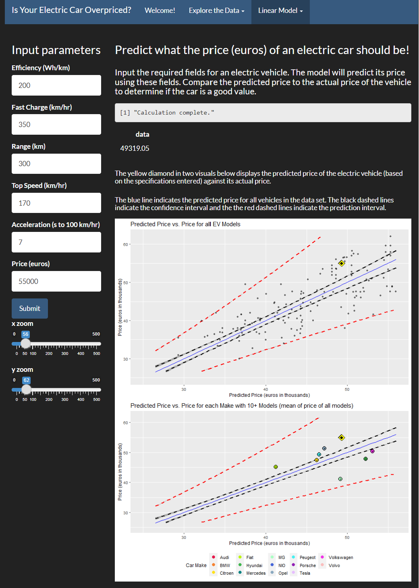

2024-01-22

# “Predict the Price of an Electric Car based on its Features”

## Table of Contents

[Overview](https://github.com/Na-ta-lie/Is-your-electric-car-overpriced-/blob/main/README.md#Overview)  
[Data](https://github.com/Na-ta-lie/Is-your-electric-car-overpriced-/blob/main/README.md#Data)  
[Development](https://github.com/Na-ta-lie/Is-your-electric-car-overpriced-/blob/main/README.md#Development)  
[Visuals](https://github.com/Na-ta-lie/Is-your-electric-car-overpriced-/blob/main/README.md#Visuals)  
[Links](https://github.com/Na-ta-lie/Is-your-electric-car-overpriced-/blob/main/README.md#Links)

### Overview

This [R Shiny
app](https://na-ta-lie.shinyapps.io/Electric_Vehicle_MLR_Price_Predictor/)
allows you to explore and compare the features of 307 electric vehicles,
and predict what the price of an electric car should be based on its
features.

You can also compare the predicted price of a vehicle to the mean price
for car makes with 10+ models included in the data set.

**See how your car compares to others so you don’t end up overpaying!**

### Data

This collection of data on electric vehicles came from
[Kaggle](https://www.kaggle.com/datasets/fatihilhan/electric-vehicle-specifications-and-prices/).
The original set included 360 observations and 9 variables.

**Variables**

- Battery: The capacity of the vehicle’s battery in kilowatt-hours
  (kWh).
- Car_name: The model name of the electric vehicle.
- Car_name_link: A direct link to the corresponding page on EV Database
  for more in-depth information.
- Efficiency: The energy efficiency rating of the vehicle in watt-hours
  per kilometer (Wh/km).
- Fast_charge: The fast-charging capability of the vehicle in minutes
  for a certain charging percentage.
- Price.DE.: The price of the electric vehicle in Germany.
- Range: The driving range of the vehicle on a single charge in
  kilometers.
- Top_speed: The maximum speed the vehicle can achieve in kilometers per
  hour.
- Acceleration..0.100.: The acceleration time from 0 to 100 kilometers
  per hour.

### Development

This data required minimal processing. I created a Make variable by
extracting the first word from the Car_name variable. I also renamed
several columns to make them more intuitive. For example, I changed
acceleration..0.100. to Acceleration. I split the dataframe into two. A
dataframe containing cars with prices called ecars (309 objects), and
one containing cars missing prices called ecars_missing_price (51
objects). I removed the two cars that did not have fast charge
capability (the Renault Twingo Electric and the e.Go e.wave X) because
this was an important feature in the linear regression and was impacting
their price.

307 electric cars with 45 unique car makes were included in the ecars
data used to create the linear model. Additionally 14 makes that have 10
or more car models are highlighted throughout the project.

I used a multiple linear regression to determine the relationship among
the continuous variables and price. I started by making a linear model
including all the continuous variables. Using that model and an empty
model I did an AIC which eliminated Battery. I expected either Battery
or Range to be eliminated because of their co-linearity. Price did not
have a normal distribution so I did a BoxCox transformation and then
redid the model after transforming the price.

After constructing the model, I used it to predict the prices of the 306
vehicles in the ecars dataframe. I un-did the BoxCox transformation to
see their predicted prices in euros, and could then compare the
predicted prices to the actual prices.

**Below is the summary of the model**  

### Visuals

**The images below show a preview of how you can use this app.**

Hover over certain images to get more details. Check out the box plot
for Porsche’s acceleration below.  

Look closely at variable relationships. You can examine the co-linear
relationship between Battery and Range.  

See how an electric car’s predicted price and actual price compare by
hovering over individual data points.  

Input an electric car’s features and predict what its price should be by
following where the yellow diamond goes.  

### Links

- <https://na-ta-lie.shinyapps.io/Electric_Vehicle_MLR_Price_Predictor/>
- <https://na-ta-lie.shinyapps.io/Electric_Vehicle_Slidy_Presentation/>
